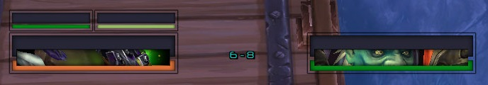
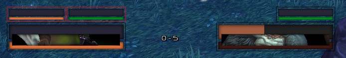

## Introduction

This guide is for the beginner oUF layout creator. It aims to demostrate how to use oUF in a structured step-by-step way.

#### Prerequisites
  1. You are familiar with the Lua 5.1 basics ([The Lua 5.1 Reference Manual](https://www.lua.org/manual/5.1/)).
  2. You know how to create a simple addon ([Getting started with writing addons](https://wow.gamepedia.com/Getting_started_with_writing_addons)).
  3. Some knowledge in _git_ is a plus ([The Git Book](https://git-scm.com/book/en/v2)).

If you are unfamiliar with the first two topics on this list, then this guide is not for you! Fill your gaps and come 
back later.

Knowing _git_ might be helpful as it makes it possible to create separate branches for your changes and you can easily 
restore your local copy of the repository to a known good state if something goes wrong.

#### How to use this guide

The basic intent is for you to follow the commits from start to end and try to recreate them yourself. Feel free to 
change the code on the go to get a better understanding of how it works.

You can of course download _oUF_Layout_ and try to customize it for your own needs if you think that this better suits 
the way you learn.

## Installation

_oUF_Layout_ is not meant for installation. You should rather recreate the layout yourself by following the commits. 
You have to install the dependencies separately as those are not embedded into the addon. Take a look at 
[oUF_Layout.toc](https://github.com/Rainrider/oUF_Layout/blob/master/oUF_Layout.toc) for a list of required and 
optional dependencies.

You should also install addons for capturing and displaying errors in-game. 
[!BugGrabber](http://www.wowinterface.com/downloads/info23141-BugGrabber.html) and 
[BugSack](http://www.wowinterface.com/downloads/info5995-BugSack.html) are a good choice.

If you however want to just install the layout and use it as is, you can download it 
[here](https://github.com/Rainrider/oUF_Layout/archive/master.zip). Rename the extracted folder to `oUF_Layout` and 
copy/move it to your `<WoW folder>\Interface\AddOns` folder.

If you are using _git_, you can issue the following commands:
  1. `cd <WoW folder>\Interface\AddOns`
  2. `git clone https://github.com/Rainrider/oUF_Layout.git`

## Debugging

[AdiDebug](https://github.com/Adirelle/AdiDebug) has been added as an optionial dependency to aid in debugging. The 
`Debug` function is added to the addon's namespace and can be called like `ns.Debug('prefix', 'message')`, where 
'prefix' is an optional string you could use for grouping messages, and 'message' is your debug output. It is a vararg 
function, so you can pass as many arguments to it as you wish. Objects and values passed to it will be coersed into 
their string representation.

Open AdiDebug by using the `/ad` or `/adidebug` slash commands and then select oUF_Layout from the dropdown menu to see 
your debug messages.

## Code Structure

The code structure has evolved during the development of _oUF_Layout_. The current state is as follows:

  - `assets` - contains fonts and textures
  - `elements` - contains code for consuming oUF elements
  - `elements\custom` - contains implementation of custom oUF elements
  - `units` - contains the style functions for the different units divided by style type
  - `fonts.xml` - a XML font template
  - `layout.lua` - uses `oUF:Factory` to spawn and style the frames for all units by calling their respective style functions
  - `settings.lua` - the configuration file
  - `utility.lua` - contains some utility functions and auxiliary stuff

## Visual Guide

Use this to compare your state to the one shown on the images. Please keep in mind that the screenshots were taken at 
the time of the corresponding commit. Errors or undescribed behaviour might occur if "outside code" (like oUF elements, 
third party addons or the WoW API) has changed since the commit has been made. Fixes for found problems are introduced 
in later commits. For some of the screenshots some internal oUF functions were temporary modified (not visible in the 
code) in order to get a better visual. Those are castbar (for the latency indicator), buffs, debuffs and stagger. Do 
not wonder if your results differ slightly.

| Commit link | Description | Screenshot |
| --- | --- | :---: |
| [0862c4](https://github.com/Rainrider/oUF_Layout/commit/0862c470863112e885f4aff45953d588b3d150ac) | player and target frames' backdrop |  |
| [2b43c7](https://github.com/Rainrider/oUF_Layout/commit/2b43c733cf5338a8bb8296e7e4817aa1f29dbc4e) | health bars |  |
| [d0ad53](https://github.com/Rainrider/oUF_Layout/commit/d0ad53382ad8a2547830bd4e38724c4130c8670c) | custom health colors |  |
| [0d7c7a](https://github.com/Rainrider/oUF_Layout/commit/0d7c7a4eddf61d0c1d8a7dc78c2ca4882a38928a) | powerbar |  |
| [4d1103](https://github.com/Rainrider/oUF_Layout/commit/4d1103ffd1f22126bd702170bdb9d7c6e2f4a42f) | portrait |  |
| [646484](https://github.com/Rainrider/oUF_Layout/commit/646484b4685e922e682d8a9816667be1a4d04a56) | castbar |  |
| [e54528](https://github.com/Rainrider/oUF_Layout/commit/e54528b38d4d01d341ad58de819616bb503e263a) | castbar text and time |  |
| [ee1333](https://github.com/Rainrider/oUF_Layout/commit/ee1333a2f0dac9ad141b327c48371ef1a96b40d1) | castbar custom time |  |
| [d7ebd8](https://github.com/Rainrider/oUF_Layout/commit/d7ebd8524e05768e239611c51af28004acf70598) / [b25f0c](https://github.com/Rainrider/oUF_Layout/commit/b25f0c6f40b1d3393a22862e20ed433b6411a2ad) | castbar interrupeted/failed |  |
| [a15b54](https://github.com/Rainrider/oUF_Layout/commit/a15b54c6ce2e25c0997ceadcd756f21771be3c06) | castbar icon |  |
| [222dce](https://github.com/Rainrider/oUF_Layout/commit/222dceb90c08ff83eb5a80c6d517a4ac3a07470e) | deathknight runes |  |
| [14b95f](https://github.com/Rainrider/oUF_Layout/commit/14b95f46458a3aaf03c05193e17c9b7893010cce) | classpower |  |
| [2fb771](https://github.com/Rainrider/oUF_Layout/commit/2fb771b1c2c5384f683ada5f81383973cf5d9cc3) | context menus |  |
| [b0ee1d](https://github.com/Rainrider/oUF_Layout/commit/b0ee1dd50a70528a4589e739895c131da2b02e26) | unit tooltips |  |
| [5a379c](https://github.com/Rainrider/oUF_Layout/commit/5a379c997519e13d8b94b8e5b71b2d887c1cc4a3) | pet and focus |  |
| [628f97](https://github.com/Rainrider/oUF_Layout/commit/628f97b0ee87c7aef2167a474e990dc8a8e08683) | focustarget and targettarget |  |
| [62017d](https://github.com/Rainrider/oUF_Layout/commit/62017db0e78e57aa5797d3cd7edfd087cedfe3fb) | castbar pet and focus |  |
| [de6f82](https://github.com/Rainrider/oUF_Layout/commit/de6f82e9f15f6f484197d6b5737c92527f2b3d92) | aggro highlight |  |
| [780d53](https://github.com/Rainrider/oUF_Layout/commit/780d53063cd1b953bad66c77de9fd2bd89c502bd) .. [135feb](https://github.com/Rainrider/oUF_Layout/commit/135febe5d13db98d0a712e27b340662835e630c6) | power and health text |  |
| [a7d077](https://github.com/Rainrider/oUF_Layout/commit/a7d077ed268c2a8044a43fc148af0636ac5a2219) | alt mana text |  |
| [6d0f39](https://github.com/Rainrider/oUF_Layout/commit/6d0f39ff11ce05e4e681406874d7df6eb0eeeace) | info text |  |
| [986ac4](https://github.com/Rainrider/oUF_Layout/commit/986ac471a5332fe61796a48318e166ed96d6d532) | debuffs |  |
| [9f2b77](https://github.com/Rainrider/oUF_Layout/commit/9f2b77109141c27ee38f3f58c94bb92d5c4ec415) | buffs |  |
| [40cef0](https://github.com/Rainrider/oUF_Layout/commit/40cef0531746cd8dfc97f1d5c5f321a85cbbc659) | auras |  |
| [26997f](https://github.com/Rainrider/oUF_Layout/commit/26997fb4337565aad5c31e32027f56dac57ad479) | power prediction |  |
| [e3bdce](https://github.com/Rainrider/oUF_Layout/commit/e3bdce08de953e5c2bc4879546473dbe0ac58d0b) | totems |  |
| [c11ff1](https://github.com/Rainrider/oUF_Layout/commit/c11ff1135545b6dca91660d0cc2bcdf56a68572d) | alternative power |  |
| [f46d0d](https://github.com/Rainrider/oUF_Layout/commit/f46d0dbd0c50a0a2f4fbb064cc5f487b31104a9d) | stagger |  |
| [f1ee0f](https://github.com/Rainrider/oUF_Layout/commit/f1ee0fe9743483f218dcd46d638f878af0ae5960) | dispel highlight |  |
| [f0c5c2](https://github.com/Rainrider/oUF_Layout/commit/f0c5c28896c8497e0a9dcd13f337476a93332a85) | artifact power |  |
| [62eee9](https://github.com/Rainrider/oUF_Layout/commit/62eee95d94f394aa4a8f2eb5e244324931381a5a) | reputation |  |
| [efa247](https://github.com/Rainrider/oUF_Layout/commit/efa2474b768f98dbdacb39ba145c2906447e33d7) | experience |  |
| [efa247](https://github.com/Rainrider/oUF_Layout/commit/efa2474b768f98dbdacb39ba145c2906447e33d7) | honor |  |
| [30929b](https://github.com/Rainrider/oUF_Layout/commit/30929b512998d9bdfc7e13c8ecf49619302cf08e) | pvp indicator |  |
| [bc1f36](https://github.com/Rainrider/oUF_Layout/commit/bc1f36803a7a17bc5ec2119bc08c61590e7fd53c) | quest indicator |  |
| [fe6e89](https://github.com/Rainrider/oUF_Layout/commit/fe6e89381e5eba5c2e587791d85d5324bc2abada) | combat indicator |  |
| [ddbc7d](https://github.com/Rainrider/oUF_Layout/commit/ddbc7d5e55cf652a18098f1c15b444b2fc19b8b7) | phase indicator |  |

## Getting Help

You can get help in the [oUF section of the WoWInterface forums](http://www.wowinterface.com/forums/forumdisplay.php?f=87), 
but please keep the following in mind:

  - put some effort in answering your question yourself before asking others for help, and demonstrate this effort when 
asking the question
  - be able to show all your code
  - be receptive for feedback and suggestions

